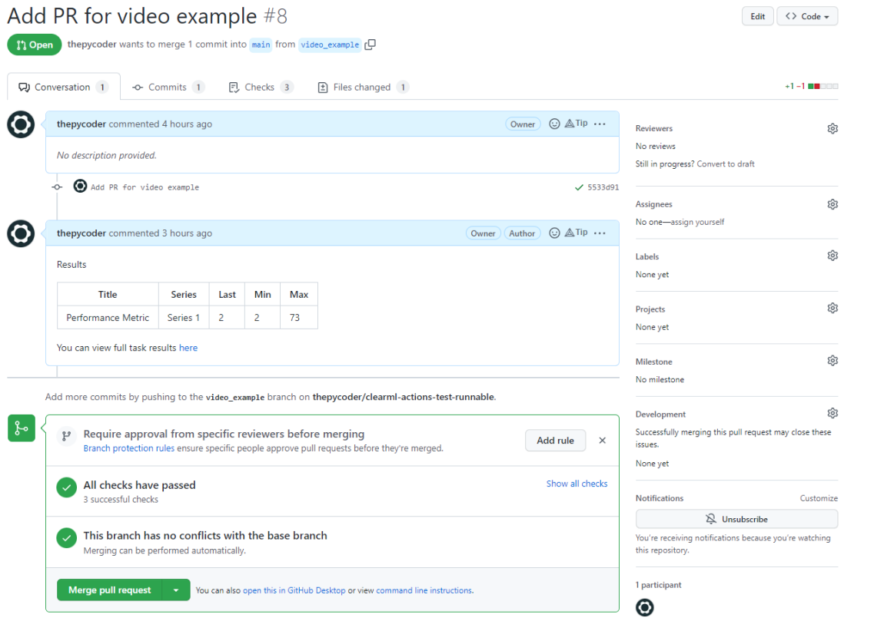
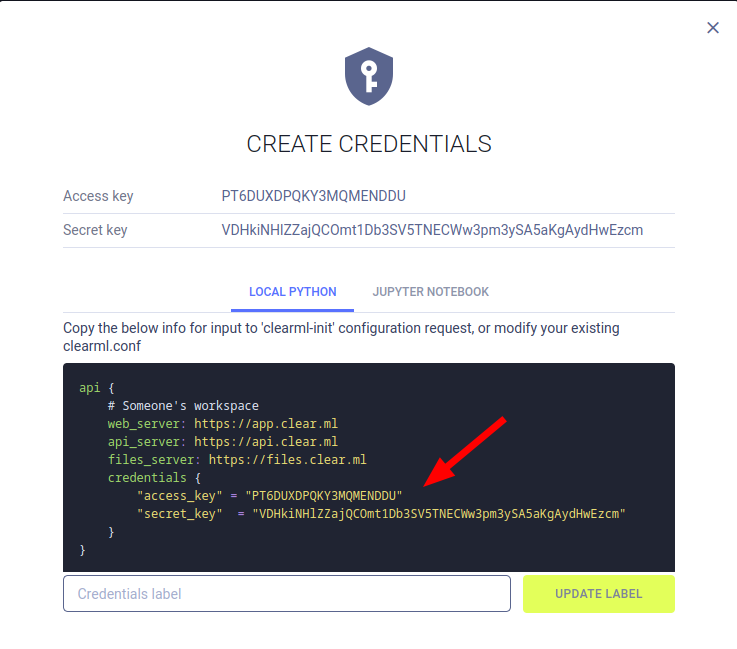

# Github CI/CD Examples



This repository serves as an example on how one can use various ClearML features to help with commen CI/CD tasks.
3 distinct jobs are shown in `run_clearml_checks.yml`, each has a corresponding python file in which most of the logic resides.

## Authentication

### ClearML
In order to connect to the ClearML server to fetch the necessary data, the Github runner needs to be authenticated. You can do that by adding the following keys in your Github Secrets:
```
CLEARML_API_ACCESS_KEY
CLEARML_API_SECRET_KEY
CLEARML_API_HOST
```
You can find the values for each of these keys either in your `clearml.conf`-file that was generated by running `clearml-init` if you already have keys, or by creating new credentials in the webUI.


### Github
We'll need a Github authentication token too, if we want to be able to post a new comment on the open PR. (Only needed for the first Job)
You can find more info about a Github token [here](https://docs.github.com/en/authentication/keeping-your-account-and-data-secure/creating-a-personal-access-token)

## Setup Workflows
In order to run this workflow, copy paste the contents of this `cicd` example folder into a new git repository. Move `run_clearml_checks.yml` to a new folder `.github/workflows/run_clearml_checks.yml` so Github can pick it up. Then add your ClearML and optionally your Github credentials to the repository secrets using the keys specified above or in `run_clearml_checks.yml`. Finally, open a PR on the new repository with a change, and see how the Github Actions spring to life!

## Job 1: Add scalars to an open PR

### When to use
Imagine you have a certain model training experiment versioned in git and you created a new feature on a sidebranch. Now, when you open a PR to merge that branch, you want to make sure that this code has at least one successful task run in ClearML. To make that visible, we can then use the SDK to get the latest model metric from that specific ClearML task and automatically post it on the PR as a comment! With a link to the original experiment in ClearML of course.

### Technical details
The job simply starts a Github Actions instance and runs `task_stats_to_comment.py` so the actual logic is all contained in that python script. So, make sure you include this script in your repository if you want to add this job to your own CI/CD.

## Job 2: Compare model performance

### When to use
The second job is similar to the first, but now we want to make sure that we never merge a code change that will worsen the model's performance. So we can again get the ClearML task corresponding to the current PR but this time compare the model metrics to the ones from the previous best ClearML task. We’ll only allow the pipeline to succeed, if the metrics are equal or better. In this way we can guarantee the quality of our main branch.

### Technical details
Similarly to Job 1, we have put all logic into the `compare_models.py` file. Please note here: this script imports a function from Job 1, so if you only want to include this job into your own project, make sure to copy the function over as well.

## Job 3: Check if code is remotely runnable by the ClearML Agent

### When to use
Usually it's a good idea to develop your code on your local computer and only later use the ClearML agent to remotely train the model for real. To make sure this is always possible, we can automatically set up the code from the PR on a ClearML agent and listen to the output. If the agent starts reporting iterations, it means the code is remotely runnable without issues. With this check, we can make sure that every commit on our main branch is ready for remote training.

### Technical details
In this job, we run 1 more command apart from running the accompanying python file (`check_remotely_runnable.py`), namely the `clearml-task` command. We can use this command to remotely launch an existing repository. In this case we will remotely launch the `example_task.py` file and then capture the Task-ID from the console output using [ripgrep](https://github.com/BurntSushi/ripgrep). Then we can send the Task-ID to the python script to poll it's status and progress.