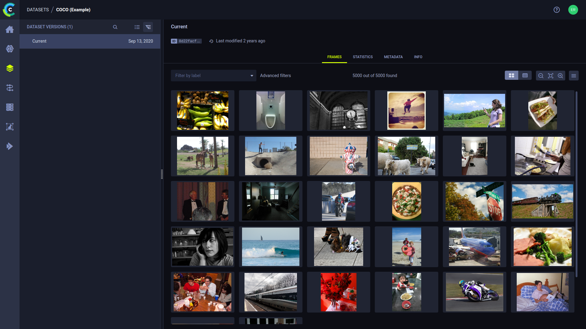

# ClearML HyperDatasets #

Hyper-Datasets is a data management system that’s designed for unstructured data such as text, audio, or visual data. It is part of the ClearML Enterprise offering, which means it includes quite a few upgrades over the open source clearml-data.

The main conceptual difference between the two is that Hyper-Datasets decouple the metadata from the raw data files. This allows you to manipulate the metadata in all kinds of ways, while abstracting away the logistics of having to deal with large amounts of data. 

To leverage Hyper-Datasets power, users define Dataviews, which are sophisticated queries connecting specific data from one or more datasets to an experiment in the Experiment Manager. Essentially it creates and manages local views of remote Datasets.

## Examples Overview ##
- Hyper-Dataset registration into ClearML Enterprise
- Hypder-Dataset usage examples, retrieving frames using the DataView Class and connecting to pytorch dataloader

## Further Resources ##

Learn about ClearML [HyperDataset](https://clear.ml/docs/latest/docs/hyperdatasets/overview)

Watch video [Tutorial](https://www.youtube.com/watch?v=1VliYRexeLU)
